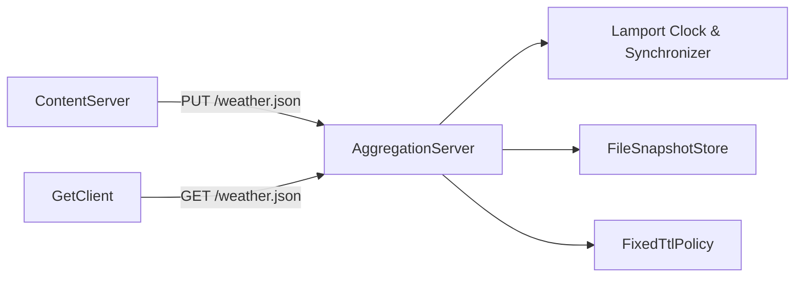

# Distributed Weather Aggregation System 🌦️  
**Author:** Mustafa Tufan Keser  
**University of Adelaide — Distributed Systems (Assignment 2)**  

---

## 🧭 Overview
In this project 87 percent code coverage is achieved. It can be seen target/site/jacoco/index.html
This project implements a **distributed weather aggregation system** that ensures **causal consistency** using **Lamport logical clocks**.  
The system is composed of three main components:

1. **ContentServer** – Sends weather data updates to the server via HTTP `PUT` requests.  
2. **GetClient** – Retrieves the most recent weather data from the server via HTTP `GET` requests.  
3. **AggregationServer** – Acts as the authoritative node that stores, orders, and serves all updates consistently.

The communication between all components follows a **Lamport logical clock protocol**, ensuring that even in distributed or concurrent environments, all updates respect the logical order of events.

---

## ⚠️ Important Warnings

1. **Delete all existing snapshot files before sending the first PUT request.**  
   - If an old snapshot exists, the first request will return `200 OK` instead of `201 Created`.  
   - Always clear `src/main/resources/temp` before making a fresh start.  

2. **Ensure consistent port configuration.**  
   - The server and client must use the same port (default: `4567`).  

3. **Do not modify Lamport headers.**  
   - These are essential for preserving event order.  

---

## ⚙️ Key Features

- **Lamport Logical Clocks:** Ensures causal ordering for all updates and reads.  
- **Lamport-Ordered Apply Queue:** Guarantees deterministic application of concurrent updates.  
- **Crash Recovery & Persistence:** Durable state management via `FileSnapshotStore`.  
- **TTL Expiry Mechanism:** `FixedTtlPolicy` removes outdated data after 30 seconds.  
- **Synchronization for Consistency:** `SimpleLamportSynchronizer` ensures read-your-writes semantics.  
- **Retry Logic:** `SimpleRetryExecutor` implements exponential backoff with jitter.  
- **High Cohesion & Loose Coupling:** Each class serves a single clear purpose.  

---

## 🏗️ High-Level Architecture



---

## 🧩 Class Responsibilities

| Class | Responsibility |
|-------|----------------|
| **ContentServer** | Sends weather updates via PUT; adds Lamport headers; retries on failure. |
| **GetClient** | Retrieves and pretty-prints weather data via GET; updates Lamport clock from responses. |
| **AggregationServer** | Handles PUT/GET, Lamport ordering, TTL expiry, and persistence. |
| **DefaultHttpHandler** | Manages HTTP request/response building and reading. |
| **LamportClock / AtomicLamportClock** | Provides logical clock operations (`tick`, `update`, `get`). |
| **LamportSynchronizer / SimpleLamportSynchronizer** | Ensures GETs wait until all relevant PUTs are applied. |
| **SnapshotStore / FileSnapshotStore** | Handles durable file-based persistence with crash recovery. |
| **ExpiryPolicy / FixedTtlPolicy** | Manages data expiration policy (TTL). |
| **RetryExecutor / SimpleRetryExecutor** | Adds network resilience via retry and jitter. |

---

## 🧪 Usage Instructions

### 1️⃣ Build
```bash
mvn -q -DskipTests clean package
mvn -q dependency:copy-dependencies -DincludeScope=runtime
```

### 2️⃣ Start the Aggregation Server
```bash
java -cp "target/classes;target/dependency/*" org.example.server.AggregationServer 4567
```

### 3️⃣ Send a PUT Request
```bash
java -cp "target/classes;target/dependency/*" org.example.client.ContentServer localhost:4567 src/main/resources/weather.txt
```

### 4️⃣ Retrieve Data
```bash
java -cp "target/classes;target/dependency/*" org.example.client.GetClient localhost:4567 /weather.json
```

---

## 🔧 Improvements and Future Work

- **Integration with SonarQube:**  
  Code quality analysis can be integrated into CI/CD pipelines as a more comprehensive alternative to JaCoCo, offering maintainability, reliability, and security checks.  

- **Extended Validation Layer:**  
  Additional validation classes can be introduced to verify JSON schemas, required fields, and data format consistency before processing.  

---

## 📂 Directory Structure

```
src/
 ├── main/
 │   ├── java/org/example/
 │   │   ├── client/           # ContentServer, GetClient
 │   │   ├── server/           # AggregationServer
 │   │   ├── http/             # DefaultHttpHandler
 │   │   ├── interfaces/       # Core contracts (Clock, Synchronizer, etc.)
 │   │   ├── persistance/      # FileSnapshotStore
 │   │   └── util/             # Utility implementations
 │   └── resources/            # weather.txt, temp/latest.json
 └── test/                     # Unit tests (optional)
```

---

## 🏁 Conclusion

This system demonstrates how **Lamport clocks** and modular design principles can achieve **causal consistency** and **fault tolerance** in a distributed environment. With retry logic, snapshot persistence, and ordered updates, the architecture offers reliability, extensibility, and maintainability in real-world distributed applications.

---

**© Mustafa Tufan Keser — University of Adelaide**
